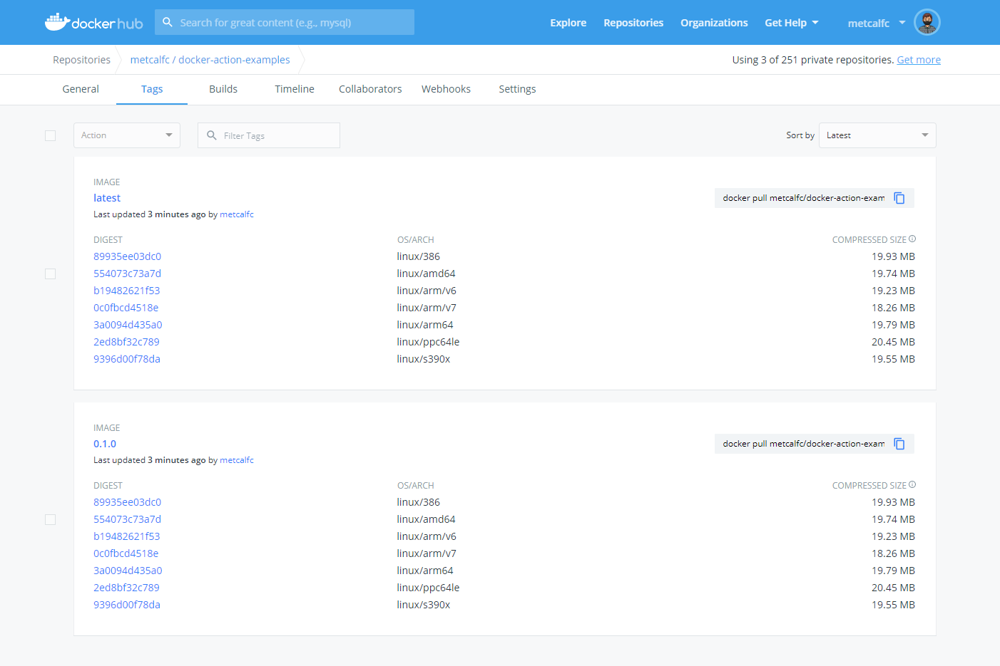

# Docker GitHub Action Example

 

Welcome. This is a simple example application to show a common Docker specific
GitHub Action setup. We have a Python Flask application that is built and
deployed in Docker containers using Dockerfiles and Docker Compose.

## Docker Actions v2

- 🚪 [Docker Login](https://github.com/docker/login-action)
- 🛠 [Setup Buildx](https://github.com/docker/setup-buildx-action)
- 🎭 [Setup Cross Platform Builds](https://github.com/docker/setup-qemu-action)
- 🔨 [Docker Build](https://github.com/docker/build-push-action)

## CI Setup

We want to setup CI to test:

- ✒ [Every commit to `main`](https://github.com/metcalfc/docker-action-examples/blob/main/.github/workflows/main-ci.yml)
- ✉ [Every PR](https://github.com/metcalfc/docker-action-examples/blob/main/.github/workflows/pr-ci.yml)
- 🌃 [Integration tests nightly](https://github.com/metcalfc/docker-action-examples/blob/main/.github/workflows/nightly.yml)
- 🐳 [Releases via tags pushed to Docker Hub.](https://github.com/metcalfc/docker-action-examples/blob/main/.github/workflows/release.yml)

We are going to use GitHub Actions for the CI infrastructure. Since its local to
GitHub Actions and free when used inside GitHub Actions we're going to [use the
new GitHub Container Registry to hold a copy of a nightly Docker
image.](https://github.com/metcalfc/docker-action-examples/blob/main/.github/workflows/main-ci.yml#L45-L51)

After CI when it comes time for production we want to use Docker's new Amazon
ECS integration to deploy from Docker Compose directly to Amazon ECS with
Fargate. So we will [push our release tagged images to Docker Hub](https://github.com/metcalfc/docker-action-examples/blob/main/.github/workflows/release.yml)
which is integrated directly Amazon ECS [via Docker Compose.](https://github.com/metcalfc/docker-action-examples/blob/main/docker-compose.yml)

The [Dockerfile](https://github.com/metcalfc/docker-action-examples/blob/main/app/Dockerfile) is setup to use multi stage builds. We have stages for
[`test`](https://github.com/metcalfc/docker-action-examples/blob/main/app/Dockerfile#L9-L12)
and [`prod`](https://github.com/metcalfc/docker-action-examples/blob/main/app/Dockerfile#L14-L16).
This means we'll need Docker Buildx and we can use the a preview of the
new Docker Buildx Action. This is going to let us achieve a couple awesome outcomes:

- We are going to use the buildx backend by default. Buildx out of the box brings a
  number of improvements over the default `docker build`. [Here.](https://github.com/metcalfc/docker-action-examples/blob/main/.github/workflows/release.yml#L40-L42)
- We are going to setup buildx caching to take advantage of the GitHub Action Cache.
  You should see build performance improvements when repeating builds with common
  layers. [Here.](https://github.com/metcalfc/docker-action-examples/blob/main/.github/workflows/release.yml#L44-L50)
  [Here.](https://github.com/metcalfc/docker-action-examples/blob/main/.github/workflows/release.yml#L70-L71)
- We are going to setup QEMU to do cross platform builds. In the example, we'll
  build this application for every Linux architecture that Docker Hub supports. [Here.](https://github.com/metcalfc/docker-action-examples/blob/main/.github/workflows/release.yml#L35-L38) [Here.](https://github.com/metcalfc/docker-action-examples/blob/main/.github/workflows/release.yml#L67)

<p align="center">
  <a href="https://hub.docker.com/repository/docker/metcalfc/docker-action-examples/tags?page=1"></a>
</p>

I'm not going to have GitHub Action manage the deployment side of this example.
Mostly because I don't want to leave an Amazon ECS cluster running. But you can
see a demo of this in one of my past streams: https://www.youtube.com/watch?v=RfQrgZFq_P0

## GitHub Container Registry FAQ

### I thought GHCR had anonymous pulls?

Its a beta product so the documentation doesn't really exist yet. If you dig around on
[GitHub's Community site](https://github.community/tag/ghcr) you can find some answers.
Thats a pain so here is what I've found.

`ghcr.io` is private by default. You'll notice in the [nightly.yml](.github/workflows/nightly.yml) I had to do a login to be able to pull the image.

You can see what packages you have by going here (change the username): https://github.com/USERNAME?tab=packages&visibility=private

You can make it public going to the packages settings (change the username and project name): https://github.com/users/USERNAME/packages/container/PROJECTNAME/settings

## Compose sample application

### Python/Flask application

Project structure:

```
.
├── docker-compose.yaml
├── app
    ├── Dockerfile
    ├── requirements.txt
    └── app.py

```

[_docker-compose.yaml_](docker-compose.yaml)

```
services:
  web:
    build: app
    ports:
      - '5000:5000'
```

## Deploy with docker-compose

```
$ docker-compose up -d
Creating network "flask_default" with the default driver
Building web
Step 1/6 : FROM python:3.7-alpine
...
...
Status: Downloaded newer image for python:3.7-alpine
Creating flask_web_1 ... done

```

## Expected result

Listing containers must show one container running and the port mapping as below:

```
$ docker ps
CONTAINER ID        IMAGE                        COMMAND                  CREATED             STATUS              PORTS                  NAMES
c126411df522        flask_web                    "python3 app.py"         About a minute ago  Up About a minute   0.0.0.0:5000->5000/tcp flask_web_1
```

After the application starts, navigate to `http://localhost:5000` in your web browser or run:

```
$ curl localhost:5000
Hello Docker and GitHub!
```

Stop and remove the containers

```
$ docker-compose down
```

## Troubleshooting

The most common error we have seen in the issues is a build failure with the error:

```buildx failed with: error: unable to prepare context: path "./yourprojectfolder" not found```

This is due to some issue with access to the code. Often the code has not been checked out. Its 
important to remember that GitHub Actions do not automatically check out a copy of the project. 
You will need to use the [checkout action](https://github.com/actions/checkout). For example:

```
- name: Checkout
  uses: actions/checkout@v2
```
